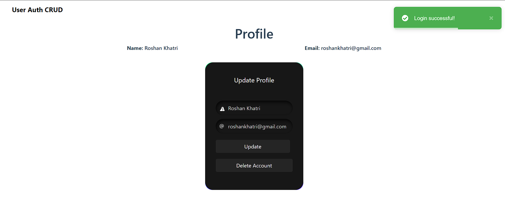

# Vue.js User Authentication & CRUD

Vue.js User Authentication & CRUD is a comprehensive web application designed to streamline user management with robust authentication and CRUD (Create, Read, Update, Delete) functionalities. Built with Vue.js, this app leverages modern development practices to ensure a seamless and secure user experience.


## Demo

Insert gif or link to demo


## Run Locally

Clone the project

```bash
  git clone https://github.com/RoshanKhatri0/Vuejs-CRUD-user
```

Go to the project directory

```bash
  cd Vuejs-CRUD-user
```

Install dependencies

```bash
  npm install
```

Start the backend server

```bash
  npm run dev
```
Go to the frontend directory

```bash
  cd user-auth-crud
```

Install dependencies

```bash
  npm install
```

Start the frontend server

```bash
  npm run dev
```
View the project

```bash
  http://localhost:5173/
```

## Frontend: Vue.js

- src/
- assets/: Static assets like images and styles.
- router/: Vue Router configuration.
- store/: Pinia store for state management.
- views/: Main views (Home, Login, Signup, Profile, AllProfile).
- App.vue: Root component.
- main.js: Main entry file.

## Backend: Node.js

- controllers/: Request handlers for routes.
- models/: Mongoose models.
- routes/: Express route definitions.
- middleware/: Middleware functions.
- app.js: Main application setup.
- server.js: Server setup.

## Screenshots





